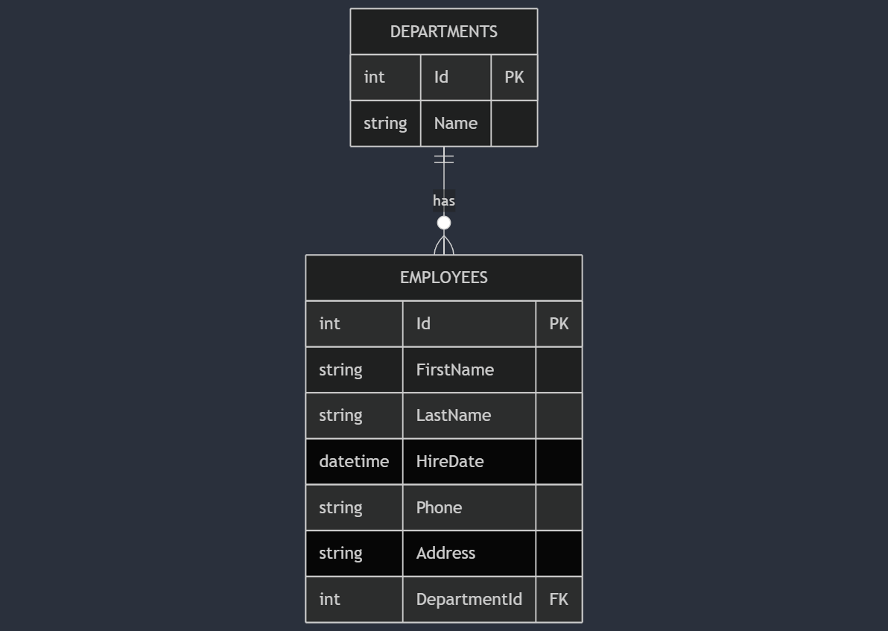
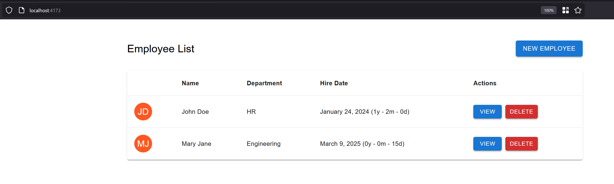

<a id="readme-top"></a>

# Employee Management - dotnet-assesment

<!-- PROJECT LOGO -->
<br />
<div align="center">
  <a>
    
  </a>

<h3 align="center">Employee Management System</h3>

</div>

## Table of contents

- [Employee Management - dotnet-assesment](#employee-management---dotnet-assesment)
  - [Table of contents](#table-of-contents)
  - [About The Project](#about-the-project)
    - [Built with](#built-with)
    - [Entity Relationship Diagram](#entity-relationship-diagram)
  - [Getting Started](#getting-started)
    - [Prerequisites](#prerequisites)
    - [Installation and usage](#installation-and-usage)
    - [1. Clone the Repository](#1-clone-the-repository)
    - [2. Run the Entire Application with Docker](#2-run-the-entire-application-with-docker)
    - [3. Navigate to the application](#3-navigate-to-the-application)


## About The Project

This project is a **Full-Stack Employee Management System** built with **.NET API**, **React (Vite)**, and **SQL Server**, containerized with **Docker Compose** for seamless deployment. It follows **Clean Architecture** principles and uses **MediatR** for handling commands and queries **(CQRS)** efficiently.The solution includes **TestContainers** for reliable, isolated end-to-end functional testing that ensures API functionality across environments.

### Built with

[![.NET][.NET]][.NET-url] [![React][React.js]][React-url] [![Docker][Docker]][Docker-url][![MSSQL][MSSQL]][MSSQL-url]

### Entity Relationship Diagram

**Entity relationship between Department and Employee**

<div align="center">
  <a>
    
  </a>

</div>

<p align="right">(<a href="#readme-top">back to top</a>)</p>

<!-- GETTING STARTED -->

## Getting Started

### Prerequisites

Before running this project, ensure you have the following installed:

**[Docker & Docker Compose](https://www.docker.com/get-started/)** – To run the entire stack in containers.  
**[Node.js (18+)](https://nodejs.org/)** – Required for the frontend.  
**[.NET SDK (8.0+)](https://dotnet.microsoft.com/en-us/download)** – To build and run the API manually.

<p align="right">(<a href="#readme-top">back to top</a>)</p>

### Installation and usage

Follow these steps to set up and run the project.

### 1. Clone the Repository

```sh
git clone https://git.number8.com/augusto.neves/dotnet-assesment.git
cd dotnet-assesment
```

### 2. Run the Entire Application with Docker

```sh
docker-compose up -d --build
```

### 3. Navigate to the application

Open your browser and access the frontend app in the URL: http://localhost:4173

- **Data:** An initial set of data will be seeded on the running API.

The home page displays the list of employees registered in the database, as shown below:



- **Swagger Documentation:** If you prefer you can navigate to the swagger API in the URL: https://localhost:5001/swagger/index.html

<p align="right">(<a href="#readme-top">back to top</a>)</p>

[.NET]: https://img.shields.io/badge/.NET-512BD4?style=for-the-badge
[.NET-url]: https://dotnet.microsoft.com/en-us/
[React.js]: https://img.shields.io/badge/React-20232A?style=for-the-badge&logo=react&logoColor=61DAFB
[React-url]: https://reactjs.org/
[Docker]: https://img.shields.io/badge/Docker-2496ED?style=for-the-badge&logo=docker&logoColor=white
[Docker-url]: https://www.docker.com/
[MSSQL]: https://img.shields.io/badge/MSSQL-black?style=for-the-badge&logo=data%3Aimage%2Fpng%3Bbase64%2CiVBORw0KGgoAAAANSUhEUgAAADAAAAAwCAYAAABXAvmHAAAACXBIWXMAAAsTAAALEwEAmpwYAAAIR0lEQVR4nO1Ze4xUVxm%2Frdi09VFbtOzc75vZbB8byyqIWChQFAwpuLSJ1VqrtQVRq1Ex1Tb2LaZRqLykD1NbAxrTELqiUJg5Z%2FYBQ6EsUGfOuQuz95y551yW5S20vCmvwJjvziwZMf1zZ%2BcPfskkc889Z%2BZ7%2Fr5zvuM4l3EZtQHPDxulto9KZVcKbfYXi8UrnFpHVvd8Vmo7T2pr6CO0fS1XsA8IbU9sDoJPOrWKbdt3DRfKbhcqPOip4BURBEMr3wttCp5vP%2BfUIqQ290tt9pGQQttjFC5S2%2FekMh1S2%2FmiYB6WyqwhTzi1iI1z5p6KQqdQAFJEKjMx6%2B%2BICW2%2FJpR5Wii7WShzQepwqVOLSA8bfqp15MhsEmC0p%2B1XpTZ7SSF6J1T43cgb2v6acqImE7lt2LDJHPFkCrGHIx5sHzVarn%2Fs8SPvzFuQ37JilZXrO8fRPKlMFyno1CIY4r0MYG86kRjLXPeejubm5W2j78gyAMUAznKAD1qHDe9aO%2F372zniD1Ox2Lh21x3s1BKY605jiEHrkCEfo%2BfViMAB1nFEmQZoZwBvtjY1%2FZYDLOaImzjAYQ5wiAPsYK47O404pQXxmoFVAmAJA3gljTiKA%2BzjiM9mHGdQKh7%2FEkcUffNSrtvIEP%2FJAI5wgNPcdV9giBkOcJTG0wDfbHGcj1RdgfabbrqOLMvi8RMMcXbL0KFX0Ximvv5qEm5VLHYtA5hLlmeIsxjiTIa4um99GvGGFMDDHHEzQ%2BxlAAvYLbdUtwCmAZZygHfJ4hzxGENMcoAfU6IzRMUB3uCJRIzmMsROjvidvrU8Hm9iAE9S6KUATnHEInPd3dx176%2BeAohTOOIa%2Bp5MJK5niA9yAJ%2BEIcFYIhFV6TTAcAawJ1NfX8cAHuUA3RxxFwP4C4UQB3iaI7akASYyAEOhtSoW%2B3S%2FK9AWj7sMYH9ZmRs4YgcD2MYRNzCAX3LEHRxgRarkIcEQ36PcIWZyyuhoaBjCEQ%2BkY7GonlByM8QXGUAPAxjWrwrMcpwrGeK5NoBbyfLlP36LwihSynXv5gAnOeIFsmzrkCE3Vq4vOs4VHDFFOXLpbxMFEzn0uxIM4AxZkAM8lHbdeNnKzVEIAeQZwI40wI84wDJ6TtbV3XZRSICnOMCGD2MhygeqOcm6uvr%2BYyLE8xxgK4VFxPukEEBIf55EnMUBWi8qizgjsqrrjuAA32CIOxkA0jvyDgeYwF33JwxxEa0rs9NZjvh6vyjA4vG7GEBnCvHn5UJ1Ju26zxCVkpAM8T%2BXWo%2BYiJe89D5HXMgAVtK8ci1ZwxD%2FzOPxX3GAqRSaVFv6RfhIAYC%2FRlyPuIlRnLvuZmKWlYMHf4IhagZwH82jGpFsaJjEE4n50dwSbXaTpRniA%2B2xWKLfhPxQ4ePxmxniibI1SaCFEYMA7ClX2jcYwCPEQlSF28eMfb%2BjuXkZhRp5yBlIEHtEdAmwO2IdxA6yMqur%2BwxH9HhDw9l0Y%2BPp1i%2BMSFLI0GZOKvOMUOYFpxbAEZ9jiBtTrruQA%2Fw7CfBQuQofJlrcuOilfaKr%2B2WpTa9QZoNQwX25ILxHKsMGWnaHA3yLikwrbRPi8V3pxsajbXeOP7h26tQnaHeaz%2BevEtqeyfT0XJ3JZAaVjqF2k1Bmt9R278AK77qTGADF%2FJ4UwOm2UaPe3vLm8pxU5nmpzYs0h05oQtmwch0pIbQ5RIoNmPBJxC%2FzeJw2bBeIYWh%2FQ60Uqe0TW3x%2FsFB2V5dvvhgd7LVtoTW5QuE2ocwaoW1eKjOBzsstxWL1t87p22%2Bfyevrz7fdOf74O%2FMXtNNYJLQ2h7bke%2Bro2fPDu6WyVmrzD6Htb6KekTJHhLbPUVjRGVkocz6b3XNtVYVfN33GnPYJE89s%2BN3vlwltXxc6%2BAGNR0Iq%2B%2FfKuV0FO11qe04qe1Zos4S6F5XvKYSy2exHqyb8xjnz%2Frjp1dcO5XwzpiSAWSyVnZ5TypXKHvS0bujzhlT22XKr5aBQpktos5XGcsqO3Lq19%2FpsGF4nlfmgasIL304TKthf2WUjgYSyC4Wyy4Qyf%2BgqhOMpD0oJapYIZZJS29k0N%2BsHd1BilxjInibrC20OV0f4bnsrWfj%2F2oZBMFQqc1Ioe5SSVmizTfjmKc%2FaG4k2pbIHaG3ffAoXqewjQtndnrZtwg86qqKAp8y%2FhB%2BsocoptJkrtVkutQmktsekNufImtIP7vof5Xw7TWq7jr4Xi8UrpQofJDqVyqTIi0KZx6W2L1VFAaHMIanMn0oKhE9GxajbNMlCuEEo81iZ9%2FdKbb5O7FK2tM0qM5lyhHqnpAxRZ99vkhGEby%2BeifsVUpuT%2BXz%2B45VjEato%2B1ZfyzBqLSrjSWXelcr8TWobSm12RLzvB1%2BpXEtrpLZ7%2Bii33yG0XVvZYS5Z3XbLnp5PVQq1NeydJJSVUtsiMYz0bUtOmymXcr1QZiwVM6dayPlmDCWpFwQjaCNGSZjr3l5PFxeyYO8tVWDTKwvhNqHogiNcRLc0FOdCmfVSmVNSWT8KG21flgXTQQXNqSY8ZSZ72h6IChOFhjY9QtvjUtm3iXm6VPj5Ui7YTtq0Va4lD9AcotccUawyx7P5sPqHli2mt0loK6QyKqfMTM%2Fzol4ogeiRFKNqS6xDHvBUOENqs7TcZt8kdPBTT9lfCG1XOQMJQRcY2qwu3ciYV2XBLo4uMko3Mxsjz5S8tETq4HtUqWld586d11CoeYXCaKcWkM2HCanNz4QyvVFlVXYfsY5U4fOeNt%2BW2o7LBsHNtHUoFTY6hdkVTi0ik8kMigpUafs8j7YX5A2qB%2BW9%2Fwn6UPIPtKyXcRmX4dQm%2FguvH%2BRcw0PJ2AAAAABJRU5ErkJggg%3D%3D
[MSSQL-url]: https://www.microsoft.com/en-us/sql-server/sql-server-downloads
